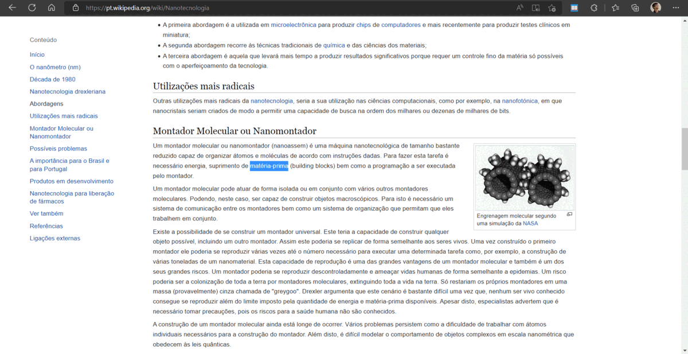

## Apresentação Geral

**Nome do Projeto:** Termonário

**Descrição:**

Termonário é uma extensão que facilita a busca de palavras, permitindo que o usuário obtenha rapidamente seus significados sem a necessidade de abrir uma nova aba.

- API: [Dicionário Aberto](https://api.dicionario-aberto.net/index.html)
- Documentação do Google: [Chrome Extensions](https://developer.chrome.com/docs/extensions/get-started?hl=pt-br)

**Objetivo:**

Implementar uma extensão que permita a consulta de palavras em um dicionário virtual.

**Tecnologias Utilizadas:**

## Contato

